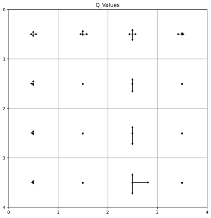

## Solving a maze using Double Q learning:

$$ Q(s, a) \leftarrow Q(s, a) + \alpha \left[ r + \gamma \max_{a'} Q(s', a') - Q(s, a) \right] $$

Q-learning has a good exploration-exploitation tradeoff compared to on-policy methods used in Reinforcement Learning. However, Q-learning suffers from overestimation bias where it uses the maximum Q-value of the next state-action pair for the TD update.

This model uses Double Q-learning to eliminate this problem by incorporating randomness. It trains the agent to solve the `FrozenLake` environment from OpenAI's Gymnasium library by using two Q functions that are updated randomly according to the following update rule:

If \( Q_A \), then: 

$$ Q_A(s, a) \leftarrow Q_A(s, a) + \alpha \left[ r + \gamma Q_B(s', \text{argmax}_{a'} Q_A(s', a')) - Q_A(s, a) \right] $$ 

If \( Q_B \), then: 

$$ Q_B(s, a) \leftarrow Q_B(s, a) + \alpha \left[ r + \gamma Q_A(s', \text{argmax}_{a'} Q_B(s', a')) - Q_B(s, a) \right] $$

- `agent()` Class:
1. `learning_rate`: determines how fast model learns. ($\alpha$)
2. `gamma`: discount factor determines how much importance should future rewards have. ($\gamma$) 
3. `epsilon`: used in $\epsilon$-greedy policy to tune the exploration-exploitation tradeoff. As epsilon decrease, the policy becomes increasingly greedy.
4. `q` & `dq`: two Q functions.

5. `e_greedy()`: given a value of `epsilon`, it chooses action according to the following probabilities: 
$P = 1 - \epsilon + \frac{\epsilon}{|\mathcal{A}|}$ for best-known action 
$P = \frac{\epsilon}{|\mathcal{A}|}$ for remaining actions, where $|\mathcal{A}|$ is the total number of actions.
6. `get_best_action`: chooses action with the best Q-value for a given state.
7. `run_policy`: plays the learnt policy.

- Q-value table is plotted after the training and arrows are used to denote the favourability of an action. 

